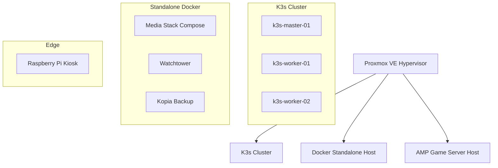

# Homelab Infrastructure as Code (IaC)

[](#)
[](#)
[](#)
[](#)
[](#)
[](#)
[](https://github.com/pre-commit/pre-commit)

A fully declarative, git-driven homelab infrastructure repository. This project provisions, configures, and deploys a multi-node virtualized environment on a Proxmox VE hypervisor, integrating automated service configurations, secure network tunnels, Single Sign-On (SSO), and media automation.

---

## 🏗️ Architecture Overview

The infrastructure is built in modular layers, separating virtualized hardware provisioning from software configuration:



### 1. Provisioning & Hypervisor Layer (Terraform)
* Proxmox Virtual Machines are deployed declaratively using the modern `bpg/proxmox` provider.
* Custom golden templates are built with **Packer** (Debian 12 base image + Cloud-Init) for fast, repeatable VM deployment.

### 2. Configuration Management (Ansible)
* **Control Plane Bootstrap**: Installs and clusters K3s across master and worker nodes.
* **Network & Tunnel Integration**: Automatically installs Tailscale on every node and authenticates via OAuth keys.
* **Storage Mounting**: Connects NFS volumes from the NAS directly to the target hosts for persistent data storage.

### 3. Compute Layers
* **Kubernetes (K3s)**: A lightweight, highly resilient cluster hosting core microservices (Authentik, Mealie, Uptime Kuma).
* **Docker Core**: A standalone compute VM running high-density docker-compose stacks for media automation and backups.
* **AMP Game Host**: A dedicated, containerized game server orchestration panel (Minecraft, etc.) mounted directly to NFS game storage.

---

## 🔒 Security & GitOps Secret Management

This repository is public-portfolio friendly. All sensitive secrets, tokens, and credentials are completely hidden using professional, zero-trust secrets management:

### 1. Git-Safe Secrets (SOPS + Age)
* All sensitive variables are stored in `secrets.yaml`, encrypted locally using Mozilla's **SOPS** with **Age** keys.
* The encrypted file is committed directly to GitHub safely. Key names and structure remain visible, while actual values are encrypted.

### 2. Zero-Disk Private Key Management (Proton Pass Integration)
* To prevent private keys from living on the local disk, the `age` decryption key is stored inside a secure vault in **Proton Pass**.
* The local terminal uses the **Proton Pass CLI (`pass-cli`)** authenticated via a personal access token (`Terraform Automation`) to load the private key directly into the terminal session's RAM:
  ```bash
  export SOPS_AGE_KEY=$(pass-cli item view --item-title "sops-private-key" --vault-name "Hosted" --field password)
  ```
* No decryption keys ever touch the local filesystem.

### 3. Pre-Commit Hooks (Security Enforcement)
* Every commit is automatically scanned before being pushed using **pre-commit** hooks.
* Hooks include Yelp's **`detect-secrets`** tool to scan for raw high-entropy values (such as plain-text passwords or API tokens) to prevent accidental credentials leaks, as well as automatic formatters (`terraform_fmt`, `end-of-file-fixer`, etc.).

---

## 🌐 Network Routing & Reverse Proxy

* **Layer 7 Ingress**: **Traefik Ingress Controller** handles traffic routing into the cluster.
* **Cloudflare Tunnel (`cloudflared`)**: Runs inside the cluster namespace, exposing services securely (like Authentik and Mealie) to the internet without opening ports on the local home router.
* **Dynamic Monitoring Watcher**: A custom Kubernetes controller (`kuma-ingress-watcher`) watches for Traefik `IngressRoute` annotations and dynamically registers/unregisters endpoints on Uptime Kuma using the Uptime Kuma API.

---

## 🎬 Media Automation Stack

Deployed via `docker-compose` on `docker-core-01`, featuring:
* **Gluetun VPN Integration**: Routes download clients (qBittorrent) strictly through ProtonVPN via Wireguard.
* **Dynamic Port Forwarding**: A port-weaver manager automatically grabs the forwarded VPN port and updates the download client configuration.
* **The "Arr" Automation Stack**: Sonarr, Radarr, Prowlarr, FlareSolverr, Recyclarr, and Bazarr.
* **Media Server & Requests**: Plex Media Server, Tautulli (analytics), Seerr (requests), and Seanime (anime tracking).
* **Automated Updates**: **Watchtower** monitors and updates running containers daily.

---

## 💾 Backup Strategy

* **Application Backups (Kopia)**: Deployed on the Docker host, creating deduplicated, encrypted backups of the `/var/lib/docker-data` volumes directly to local NFS backup storage.
* **Uptime Kuma Database Backups**: A custom daily cron job runs online SQLite backups of the Uptime Kuma DB directly to the NAS NFS share, ensuring zero data loss without stopping the container.
